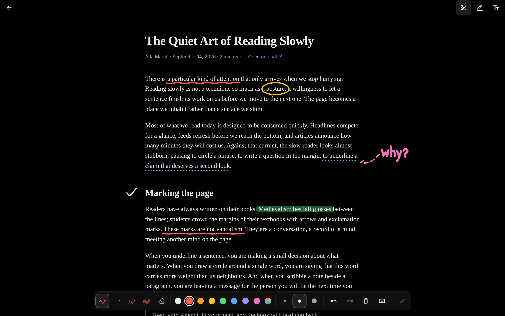
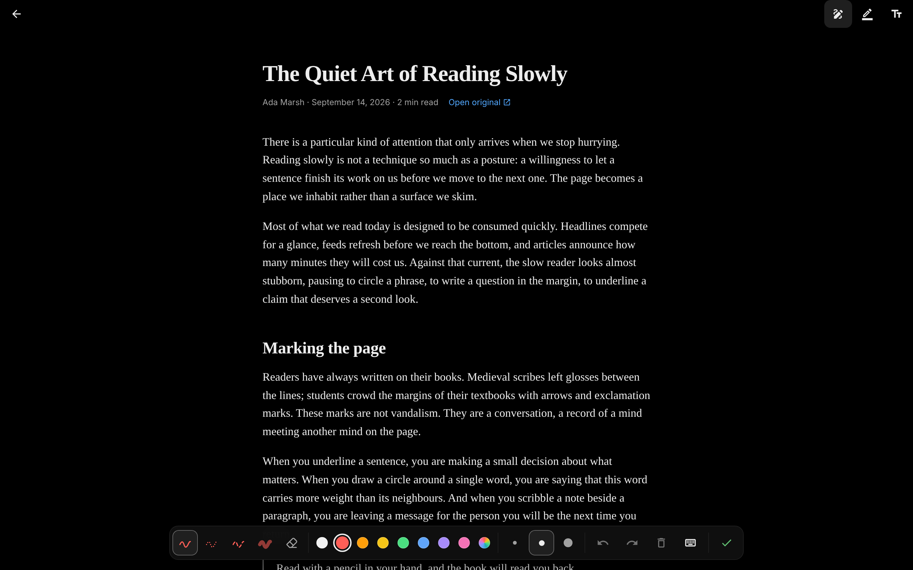
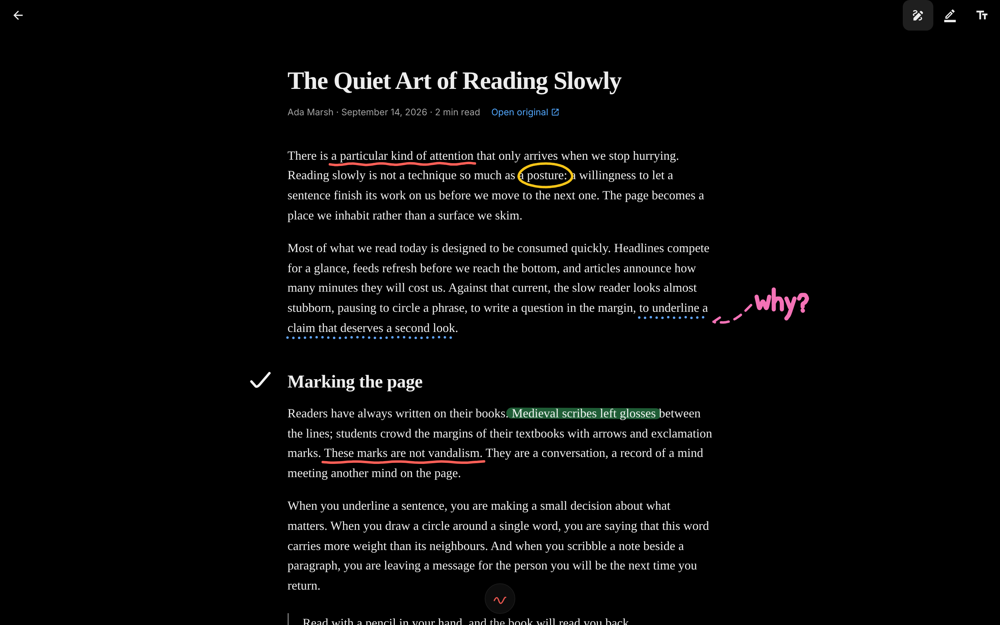
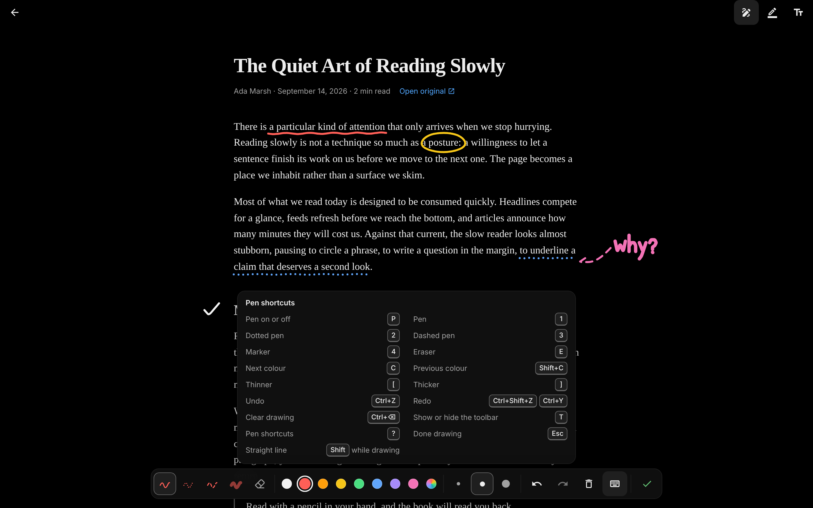

# Drawing on articles (web)

The web article reader has a pen. With it on, the page becomes a canvas:
underline, circle a word, highlight a line with a marker or write a note in
the margin, freehand, with a mouse, a stylus or a finger. Drawings are saved
on the device and come back in place the next time the article opens. The
mobile app has no pen.

## Using it

- **Draw** in the top bar, or `P`, turns the pen on and off. `Esc` or the
  check mark leaves it.
- Pens: solid `1`, dotted `2`, dashed `3`, marker `4`, eraser `E` (it removes
  whole strokes). Hold `Shift` while drawing for a straight line.
- Eight colours plus a colour picker. `C` and `Shift+C` step through them.
- Three widths. `[` and `]` step through them.
- `Ctrl/⌘+Z` undoes, `Ctrl/⌘+Shift+Z` or `Ctrl/⌘+Y` redoes, and
  `Ctrl/⌘+Backspace` clears the page (with Undo in the toast).
- `?` lists the shortcuts and `T` puts the toolbar away.

The toolbar sits at the bottom. It steps aside while you draw or scroll and
returns when you pause, when the mouse nears the bottom edge, or when a
shortcut changes the pen. Meanwhile a small chip shows the pen in use.

| Toolbar | While drawing | Shortcuts |
| --- | --- | --- |
|  |  |  |

Once a stylus has been used, a finger scrolls the page instead of drawing,
so a resting hand leaves no marks.

## Where strokes are kept

Each stroke is stored against the article block it was drawn on (by
`data-block-index`, or the header above the first block). It keeps that
block's size at drawing time and its points relative to the block's corner.
On screen it is placed from the block's current box and stretched by however
much the block grew or shrank. A drawing therefore:

- scrolls with the page (the SVG layer is part of the page, not fixed);
- reopens exactly where it was drawn ([after a reload](article-pen/after-reload.png));
- stays with its paragraph when images load above it, when skipped blocks
  render in long articles, or when the type size changes
  ([larger type](article-pen/larger-type.png)). Text reflows under a new
  size or width, so marks drawn on words land close to them, not exactly
  on them.

Notes in a margin that a narrower window cannot fit slide back onto the
page as one piece ([tablet width](article-pen/tablet.png)).

Strokes are kept in IndexedDB (`ink:article:<id>`, one record per article)
and shared between open tabs. They do not sync between devices yet: that
needs an API table and sync support. Like highlights, they stay when an
article is removed and come back if it is added again.

## Shortcuts

Shortcuts are handled by [TanStack Hotkeys](https://tanstack.com/hotkeys)
(`@tanstack/react-hotkeys`). They come from one table,
`defaultInkShortcuts` in `apps/web/src/components/article/ink/shortcuts.ts`.
Overrides stored under `thereader.shortcuts.ink` in `localStorage` take
precedence, and `saveInkShortcut` writes one. A settings screen can record
new bindings with `useHotkeyRecorder` and save them through it. Tooltips and
the shortcuts card show the bindings in use, formatted for the platform.

## Code

- `apps/web/src/lib/services/ink.ts`: the store (`services.ink`).
- `apps/web/src/components/article/ink/useArticleInk.tsx`: the canvas,
  toolbar and shortcuts.
- `apps/web/src/components/article/ink/geometry.ts`: anchoring, placement,
  smoothing and eraser hit tests.
