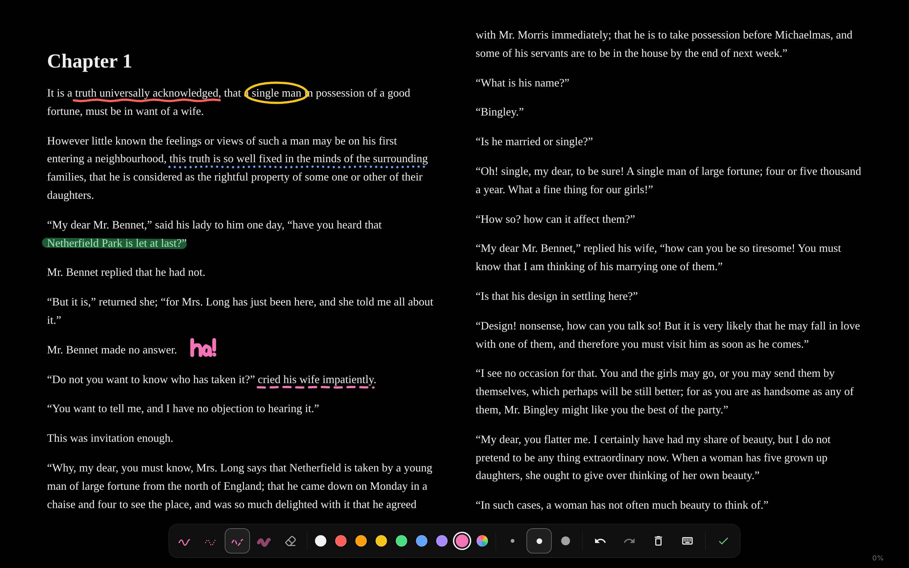
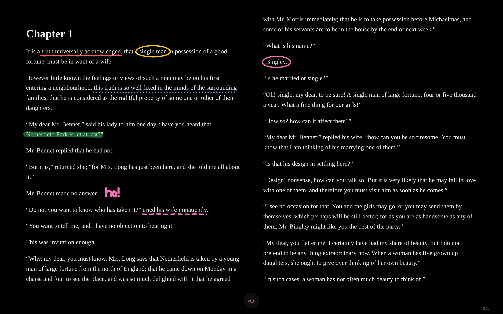
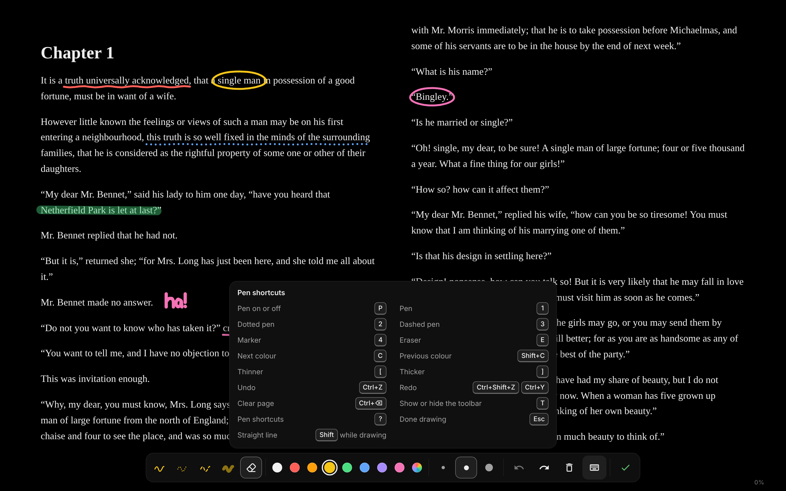
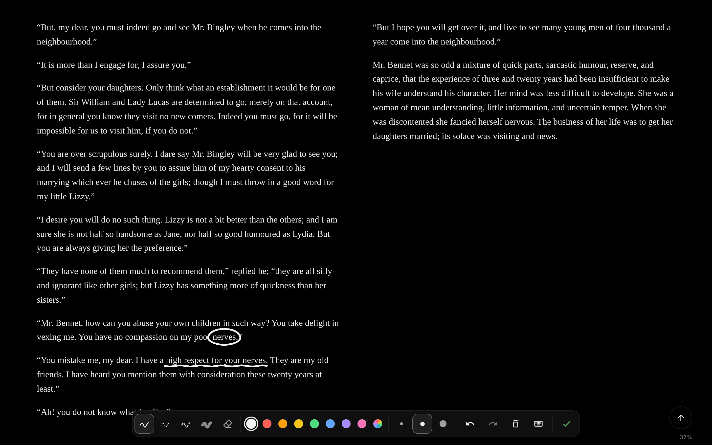
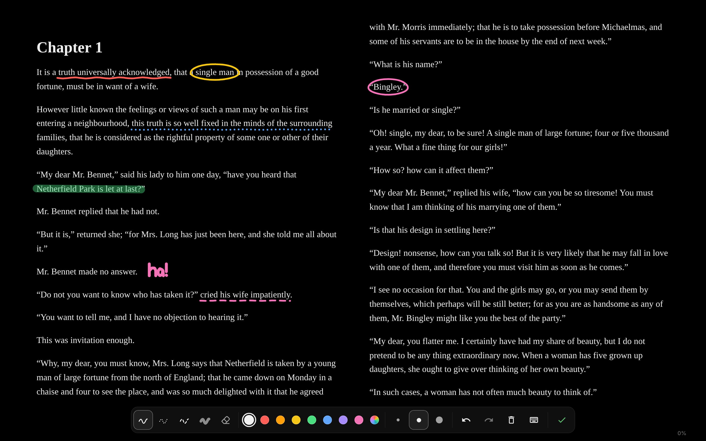
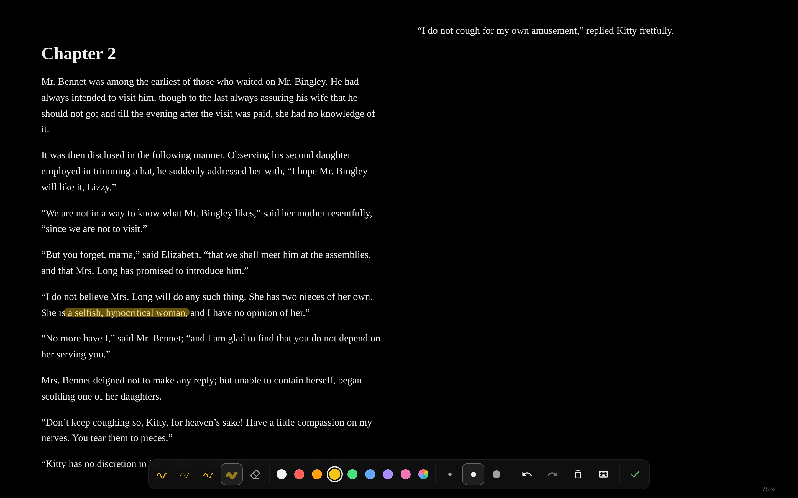
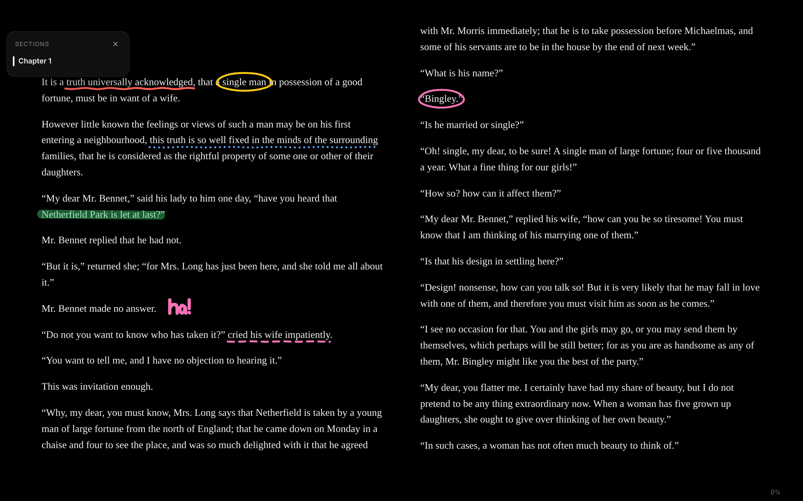
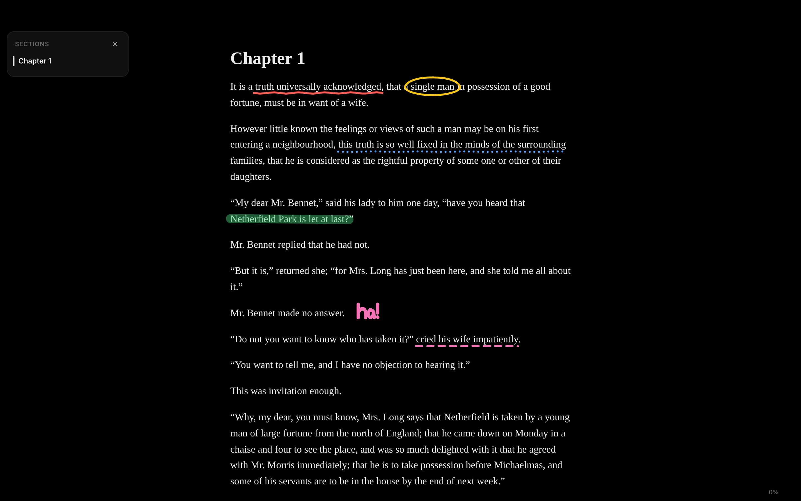
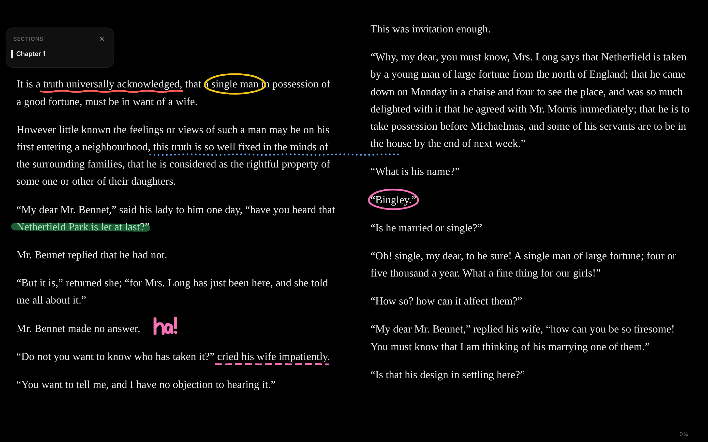

# Drawing with the pen (web)

The web app's article reader and book reader both have a pen. With it on,
the page becomes a canvas: underline, circle a word, highlight a line with a
marker or write a note in the margin, freehand, with a mouse, a stylus or a
finger. Drawings are saved on the device and come back in place the next
time the article or book opens. The mobile app has no pen.

## Using it

- **Draw** in the top bar, or `P`, turns the pen on and off. `Esc` or the
  check mark leaves it. In a book, the reading controls and the floating
  contents step off the page while the pen is on.
- Pens: solid `1`, dotted `2`, dashed `3`, marker `4`, eraser `E` (it removes
  whole strokes). Hold `Shift` while drawing for a straight line.
- Eight colours plus a colour picker. `C` and `Shift+C` step through them.
- Three widths. `[` and `]` step through them.
- `Ctrl/⌘+Z` undoes and `Ctrl/⌘+Shift+Z` or `Ctrl/⌘+Y` redoes.
  `Ctrl/⌘+Backspace` clears the article's drawing, or the strokes on the
  book page in view, with Undo in the toast.
- `?` lists the shortcuts and `T` puts the toolbar away.
- In a book, pages still turn with the arrow keys, the wheel and (once a
  stylus has been used) a finger swipe while the pen is on.

The toolbar sits at the bottom. It steps aside while you draw or scroll and
returns when you pause, when the mouse nears the bottom edge, or when a
shortcut changes the pen. Meanwhile a small chip shows the pen in use.

| Toolbar | While drawing | Shortcuts |
| --- | --- | --- |
|  |  |  |

Once a stylus has been used, a finger scrolls (or turns the page) instead of
drawing, so a resting hand leaves no marks.

## Books

A book's strokes are drawn inside the book's own frame, on a layer at the
chapter document's origin, outside its text. They therefore move with the
text: a page turn (the paginated columns scroll sideways) carries a page's
drawing off with it and brings the next page's in, and scrolling carries
them like the words beside them. Each stroke is anchored to one character
of its chapter: the one under the middle of the stroke, or the nearest on
that page when the stroke is in a margin or a gap. The stroke keeps that
character's offset, a little of the text around it, the height of its line,
and its points relative to the character's box.

The engine places the chapter's strokes again whenever it shows or lays out
a chapter: when the book opens, on every chapter change, and after a
resize, a type change, a flow change, or late images and fonts. Page turns
need no work, because the strokes are part of the page.

| Page 1 | Page 2 | Back to page 1 |
| --- | --- | --- |
|  |  |  |

| Chapter 2 | Reopened | Scrolled flow | Larger type |
| --- | --- | --- | --- |
|  |  |  |  |

With the same layout, a stroke returns exactly where it was drawn. With
another layout (scrolled instead of paginated, another size or window), it
stays beside its character and scales with the line height. A long line
drawn along a whole line of text follows the character it is anchored to,
so after the text rewraps it can reach past the new line's end.

The pen's keys also work while focus is inside the book's frame: the frame
forwards them, and they are matched against the same bindings.

## Articles

Each stroke is stored against the article block it was drawn on (by
`data-block-index`, or the header above the first block). It keeps that
block's size at drawing time and its points relative to the block's corner.
On screen it is placed from the block's current box and stretched by however
much the block grew or shrank. A drawing therefore:

- scrolls with the page (the SVG layer is part of the page, not fixed);
- reopens exactly where it was drawn ([after a reload](article-pen/after-reload.png));
- stays with its paragraph when images load above it, when skipped blocks
  render in long articles, or when the type size changes
  ([larger type](article-pen/larger-type.png)). Text reflows under a new
  size or width, so marks drawn on words land close to them, not exactly
  on them.

Notes in a margin that a narrower window cannot fit slide back onto the
page as one piece ([tablet width](article-pen/tablet.png)).

## Storage

Strokes are kept in IndexedDB, one record per article (`ink:article:<id>`)
and one per book edition (`ink:book:<sha256>`, every chapter's strokes
together), and shared between open tabs. They do not sync between devices
yet: that needs an API table and sync support. Like highlights, they stay
when an article or book is removed and come back if it is added again.

## Shortcuts

Shortcuts are handled by [TanStack Hotkeys](https://tanstack.com/hotkeys)
(`@tanstack/react-hotkeys`). They come from one table,
`defaultInkShortcuts` in `apps/web/src/components/ink/shortcuts.ts`.
Overrides stored under `thereader.shortcuts.ink` in `localStorage` take
precedence, and `saveInkShortcut` writes one. A settings screen can record
new bindings with `useHotkeyRecorder` and save them through it. Tooltips and
the shortcuts card show the bindings in use, formatted for the platform.
While the pen owns a key, the readers' own handlers leave it alone (`P`,
and `Esc`, `T`, `C`, `[`, `]` and `?` while drawing).

## Code

- `apps/web/src/lib/services/ink.ts`: the store (`services.ink`) and the
  stroke and anchor types.
- `apps/web/src/lib/inkPaths.ts`: smoothing, pen widths and dashes, and
  eraser hit tests, shared by both readers.
- `apps/web/src/components/ink/useInk.tsx`: the pen: gestures, toolbar,
  shortcuts and undo, over any `InkSurface`.
- `apps/web/src/components/article/ink/`: the article surface (block
  anchors and the page's SVG).
- `apps/web/src/reader/epub/ink.ts`: the book surface inside the engine
  (text anchors and the frame's layer). `routes/reader.tsx` connects it to
  the pen through the `ReaderEngine` ink methods.
